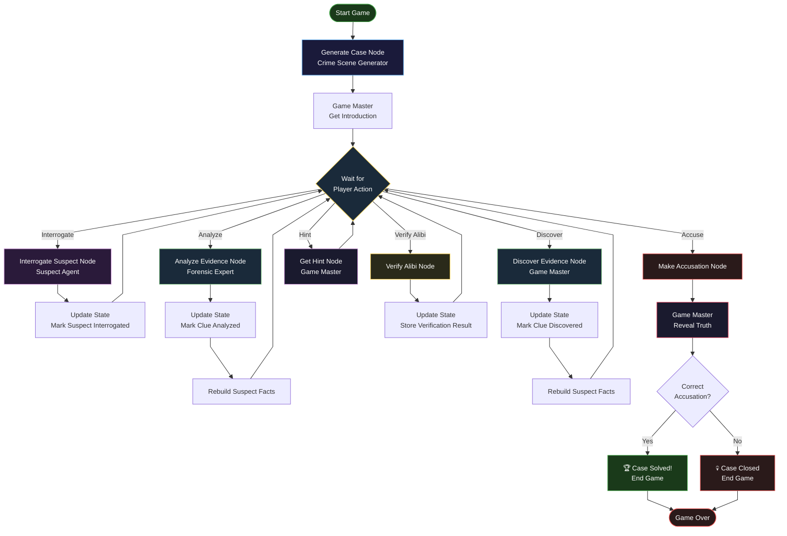

<div align="center">
  <h1>🔍 AI Murder Mystery</h1>
  <p><strong>A Multi-Agent Detective Game Powered by LangGraph and Groq</strong></p>
  
  [](#)
  [](#)
  [](#)
  [](#)
</div>

---


---

## 📖 Project Overview

**AI Murder Mystery** is an immersive, single-player detective game where you interrogate AI-powered suspects to solve a dynamically generated murder case. The game uses a sophisticated **multi-agent system** powered by LangGraph and Groq's LLM API to create a living, reactive crime scene where every suspect has a secret, every clue matters, and the truth is waiting to be uncovered.

Unlike traditional static mystery games, this project leverages AI agents to generate unique cases, respond to player questions with realistic personalities, and provide consistent, logical narratives that challenge players to think like real detectives.

---

## ✨ Key Features

### 🎮 Core Gameplay
- **Dynamic Case Generation**: Every playthrough generates a unique murder mystery with different suspects, motives, and evidence
- **AI-Powered Suspects**: Each suspect has a unique personality, backstory, secrets, and alibi—and they'll lie, deflect, and react emotionally when interrogated
- **Evidence Discovery & Analysis**: Search crime scenes for clues, then analyze them through a forensic expert agent for actionable insights
- **Alibi Verification**: Verify suspects' alibis through external witnesses and evidence—some alibis are true, others are cleverly constructed lies
- **One-Accusation Gameplay**: Make your final accusation—get it right and solve the case, or watch the killer walk free

### 🤖 Multi-Agent Architecture
- **Game Master Agent**: Orchestrates the narrative, provides hints, and reveals the truth at the end
- **Suspect Agents**: Each suspect is a unique agent with personality, facts, and deception capabilities
- **Forensic Expert Agent**: Provides cold, factual analysis of evidence without speculation
- **Crime Scene Generator**: Creates consistent, challenging cases with a fact based clue system

### 🎨 User Interface
- **Real-time Chat Interface**: Interrogate suspects and receive responses with emotional expressions like `[crossing arms defensively]`
- **Evidence Board**: Track discovered clues and their analysis status
- **Suspect Panel**: See which suspects have been interrogated and who the killer is after the game ends
- **Notes System**: Take notes to track your investigation
- **Comprehensive Debrief**: After the game, see the full picture—who the killer was, their motive, and how the evidence pointed to them

---

## 🧠 System Architecture

The game is built on a sophisticated **multi-agent orchestration system** using LangGraph:


​
---

### Agent Roles

| Agent | Role | Key Feature |
| :--- | :--- | :--- |
| **Game Master** | Orchestrates the game flow, provides narrative, validates accusations | Knows the absolute truth, never reveals directly |
| **Suspects** | Role-playing characters with unique personalities and secrets | Can lie, deflect, or tell partial truths based on their facts |
| **Forensic Expert** | Provides objective, factual analysis of evidence | Cold, unbiased, no speculation |
| **Crime Scene Generator** | Creates new cases with consistent clues and facts | Generates date/time, murder method, suspects, and fact-based clues |

---

## 🛠️ Tech Stack

**Backend:**
- Python
- FastAPI & Uvicorn

**Frontend:**
- LangGraph & LangChain (Agent Orchestration)
- Groq API (LLM Inference - Llama 3, Mixtral)

**Utilities:**
- Pydantic (Data Validation)
- Loguru (Logging)
- WebSockets (Real-time Chat)

---

## 🚀 Setup & Installation

### 1. Clone the Repository
```bash
git clone https://github.com/yourusername/ai-murder-mystery.git
cd ai-murder-mystery
```

### 2. Create a Virtual Environment
```bash
python -m venv venv_murder
source venv_murder/bin/activate  # On Windows: venv_murder\Scripts\activate
```

### 3. Install Dependencies
```bash
pip install -r backend/requirements.txt
```

### 4. Set Up Environment Variables
Create a `.env` file in the `backend/` directory:
```env
GROQ_API_KEY=your_groq_api_key_here
```

### 5. Run the Backend Server
```bash
cd backend
python -m app.main
```

### 6. Serve the Frontend
Open a new terminal:
```bash
cd frontend
python -m http.server 3000
```

### 7. Play the Game
Open `http://localhost:3000` in your browser and click **Start Game**!

---

## 🎮 How to Play

### Game Flow

1. **Start Game**: The Crime Scene Generator creates a unique murder case
2. **Search for Evidence**: Explore the crime scene to discover clues (max 5 clues, 1-2 red herrings)
3. **Analyze Evidence**: Click on discovered clues to get forensic analysis
4. **Interrogate Suspects**: Ask questions to each suspect—they'll respond in character with emotions like `[crossing arms defensively]`
5. **Verify Alibis**: Check if suspects' alibis are true or false using the "Verify Alibi" action
6. **Accuse**: When confident, accuse someone of the murder—one chance to get it right!

### Tips for Success

- **Connect the dots**: One clue alone rarely solves the case—look for patterns across evidence
- **Ask the right questions**: Ask suspects about their alibi, clothing, shoe size, and whereabouts
- **Follow up on contradictions**: When a suspect's alibi is verified as false, dig deeper
- **Use notes**: Take notes on what each suspect said to track inconsistencies
- **Trust the evidence**: The forensic expert provides cold, factual analysis—use it!

---

## 📊 Example Gameplay

### Evidence Discovery
```
🔎 Searching for evidence: the crime scene
"A faint footprint is pressed into the soft earth near the crime scene, shadowed by the brush. It's worth examining further."
🔒 New evidence logged: Size 9 Footprint — click it in the evidence panel and analyze to reveal details.
```

### Evidence Analysis
```
🔬 Analyzing: Size 9 Footprint
Forensic Analysis:
• Footprint is size 9, consistent with a men's dress shoe
• The tread pattern matches a popular brand
• It was made around the time of the murder
• Ask all male suspects what size shoe they wear
```

### Suspect Interrogation
```
🔍 To James Parker: where were you at the time of the murder?
[crossing arms defensively] I was at the office, working late. I sent an email at 9:30 PM—you can check the timestamp.
```

### Alibi Verification
```
✅ Verifying James Parker's alibi...
❌ James Parker's alibi has been CONTRADICTED: Office security footage shows no one entered the building after 8 PM.
```

### Accusation
```
⚖️ Accusing: James Parker
🎉 CASE SOLVED!
You caught the killer!
🔴 Killer: James Parker
📖 Motive: To stop the embezzlement investigation before he was exposed
📌 Details: James poisoned Richard's drink during a private meeting, then used his knowledge of the office to create a false alibi.
```

---

## 🤝 Contributing

Contributions, issues, and feature requests are welcome! Feel free to check the [issues page](https://github.com/yourusername/ai-murder-mystery/issues).

---

## 📝 License

This project is [MIT](https://choosealicense.com/licenses/mit/) licensed.

---

## 🙏 Acknowledgments

- Built with [Groq](https://groq.com/) for fast, free LLM inference
- Orchestrated using [LangGraph](https://www.langchain.com/langgraph)
- Inspired by classic murder mystery games and detective fiction

---

<div align="center">
  <p>Made with ❤️ by Shivansh</p>
  <p>⭐ Star this repository if you enjoyed the game!</p>
</div>
```
